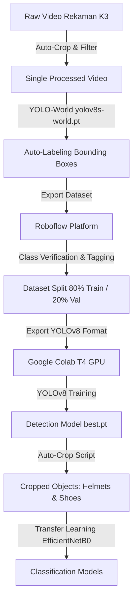

# APD Detection & Classification Dataset Pipeline

Modul ini berisi skrip otomatisasi pemrosesan dataset, auto-labeling, ekstraksi crop objek, dan pelatihan model transfer learning CNN.

---

## 📋 Alur Pemrosesan Dataset (End-to-End Pipeline)

---

## 🛠️ Skrip Pipeline & Kegunaannya

| Nama Skrip | Deskripsi |
|---|---|
| `auto_label_yoloworld.py` | Menggunakan model zero-shot `yolov8s-world.pt` untuk mendeteksi dan memberi label otomatis pada frame video/gambar APD. |
| `auto_crop_helmets.py` | Membaca anotasi YOLO dan mengekstrak crop gambar helm (safety vs non-safety) untuk dataset training klasifikasi. |
| `auto_crop_shoes.py` | Membaca anotasi YOLO dan mengekstrak crop gambar sepatu pekerja untuk dataset training klasifikasi. |
| `train_cnn_shoes_colab.py` | Skrip transfer learning CNN berbasis **EfficientNetB0** di Google Colab untuk mengklasifikasikan sepatu safety vs non-safety. |
| `test_model_inference.py` | Skrip pengujian mandiri model hasil training pada video/gambar uji. |

---

## 🚀 Pelatihan di Google Colab

Proses pelatihan model YOLOv8 dan CNN dilakukan di Google Colab dengan akselerasi GPU (T4 GPU).

🔗 **Colab Training Notebook:**  
[Buka Google Colab Training Notebook](https://colab.research.google.com/drive/1w37FpfkGKSxxVAAef55YZxGcfffT4Qg3?usp=sharing)

### Langkah Pelatihan di Colab:
1. Buka link Google Colab di atas.
2. Atur runtime ke **T4 GPU** (`Runtime > Change runtime type > T4 GPU`).
3. Upload dataset hasil olah dari Roboflow (misal `APD.v1i.yolov8.zip`).
4. Jalankan cell untuk ekstraksi dataset dan konfigurasi file `data.yaml`.
5. Eksekusi proses pelatihan (training YOLOv8 selama 50-100 epoch).
6. Download file bobot terbaik `best.pt` dan letakkan di folder `models/detection/`.
7. Lakukan fine-tuning model klasifikasi menggunakan `train_cnn_shoes_colab.py` dan simpan bobotnya ke `models/classification/`.
